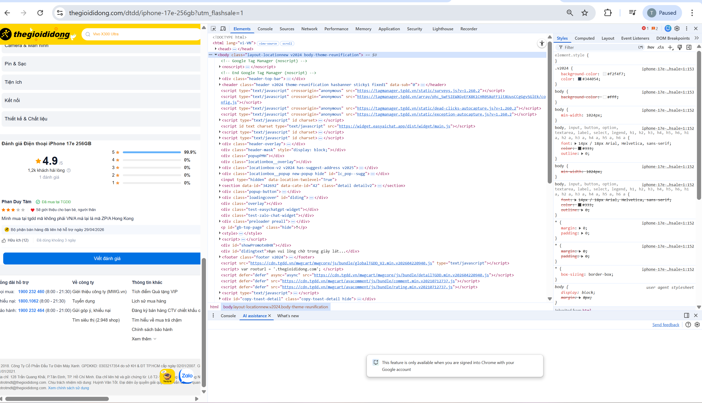
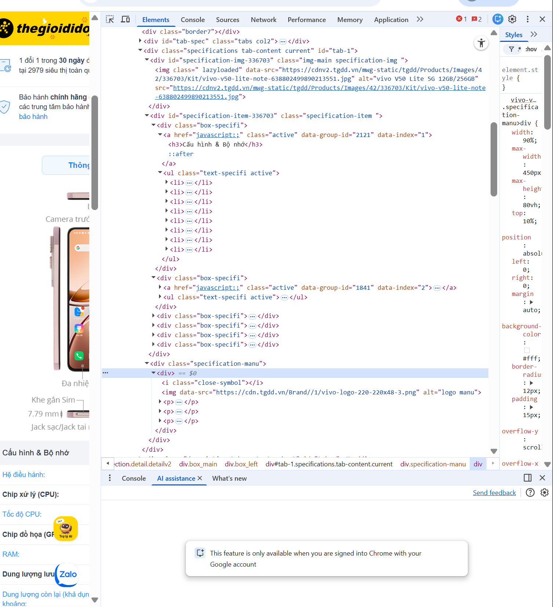
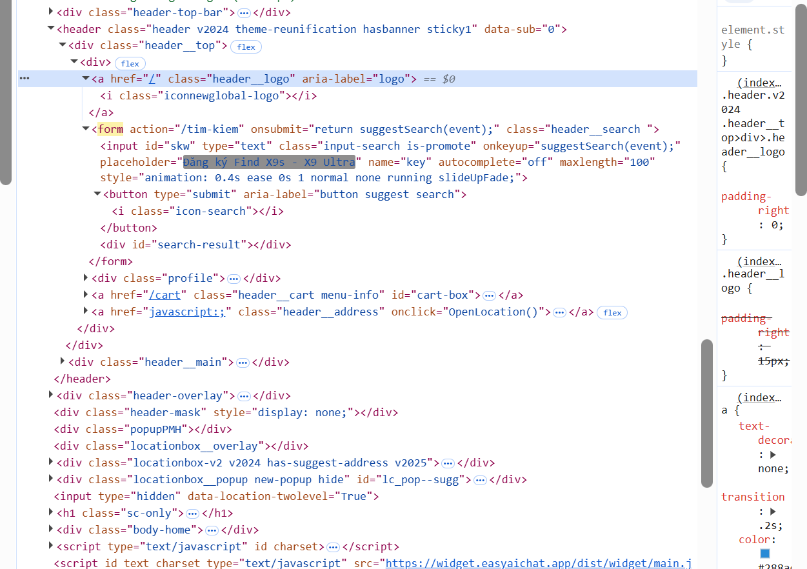

# 📋 PHIẾU BÀI TẬP 01
## PHẦN A — KIỂM TRA ĐỌC HIỂU (25 điểm)
## Câu A1 (5đ) — HTTP & Browser
1. Khi bạn gõ https://shopee.vn vào trình duyệt và nhấn Enter, hãy liệt kê đúng thứ tự ít nhất 5 bước xảy ra (từ DNS lookup đến render).
* Bước 1:  Trình duyệt thực hiện DNS lookup để chuyển shopee.vn thành địa chỉ IP 
* Bước 2: Trình duyệt thiết lập kết nối TCP/TLS tới server thông qua mạng Internet
* Bước 3: Trình duyệt gửi HTTP request đến server
* Bước 4: Server xử lý yêu cầu và trả về HTTP response (HTML, CSS, JS)
* Bước 5: Trình duyệt nhận dữ liệu, phân tích HTML và tải thêm tài nguyên
* Bước 6: Trình duyệt render giao diện và hiển thị trang shopee

Nguồn tham chiếu: tuan_1_html5/01_introduction_html_universe.md/1.Web hoạt động như nào 

2. Trong DevTools cuả Chrome, tab Network cho thấy thông tin gì? 
* Tab Network hiển thị tất cả request và response giữa trình duyệt và server, bao gồm danh sách tài nguyên tải về, status code, nguồn gọi request, dung lượng, thời gian tải và nội dung request/response
3. Hãy mở một trang web bất kỳ, chụp screenshot tab Network và đánh dấu (vẽ mũi tên/khoanh tròn) vào:
Hình minh họa Network

* Status Code của request đầu tiên: màu đỏ    
* Tổng thời gian load trang: màu xanh 
* Một request trả về file CSS: màu vàng

Nguồn tham chiếu: tuan_1_html5/00_design_thinking_layout.md/4. DEVTOOLS: CHUỘT PHẢI → INSPECT

## Câu A2 (5đ) — Semantic HTML
### Đọc chương 04, trả lời: Tại sao trang web dưới đây bị Google đánh giá SEO thấp? Liệt kê ít nhất 4 lỗi semantic và sửa lại.

    
ShopTLU

    

        
<a href="/">Trang chủ</a>

        
<a href="/products">Sản phẩm</a>

    

    

        
iPhone 16 Pro

        
25.990.000đ

        

    

© 2026 ShopTLU

* Lỗi 1 : Lỗi "Div Soup" cho cấu trúc chính -> Googke khó đọc, phải đoán cấu trúc .
* Lỗi 2 : Thiếu thẻ điều hướng `<nav>` -> việc dùng `
` làm Google không hiểu đây là các đường dẫn quan trọng nhất trong trang
* Lỗi 3 : Không dùng thẻ `<article>` cho sản phẩm -> thẻ `<article>` dùng cho các nội dung viết blog hoặc sản phẩm 
* Lỗi 4 : Dùng `
` không có trọng số -> sai lệch phân cấp tiêu đề, Google không xếp hạng được từ khóa
* Lỗi 5 : Lỗi dùng Media, thiếu alt và không dùng figure
Nguồn tham chiếu: tuan_1_html5/04_visible_part_html.md/Semantic HTML5 — "Thẻ có ý nghĩa"

## Câu A3 (5đ) — Block vs Inline
### Không chạy code, hãy vẽ tay (hoặc mô tả bằng text art) kết quả hiển thị của đoạn HTML sau. Giải thích tại sao.

Hộp 1

Text A
Text B

Hộp 2

Text C
<strong>Text D</strong>

Hộp 3

* Kết quả hiển thị : 

### Giải thích :
* **dùng `
`** - > dùng Block element chiếm cả dòng và luôn xuống dòng
* **dùng `` và `<strong>`** -> dùng Inline element chỉ chiếm nội dung và nằm cạnh nhau

Nguồn tham chiếu: tuan_1_html5/04_visible_part_html.md/Block vs Inline — Hai loại element cơ bản

## Câu A4 (5đ) — Table
### Đọc chương 05. Giải thích sự khác nhau giữa `<thead>, <tbody>, <tfoot>`. Tại sao KHÔNG NÊN dùng table để tạo layout trang web? (Ghi rõ ít nhất 3 lý do)
* Sự khác nhau giữa `<thead>, <tbody>, <tfoot>`
1. `<thead>` - (table head) - phần tiêu đề của bảng: chứa tên cột và nằm trên cùng đầu của bảng
2. `<tbody>` - (table body) - phần nội dung chính của bảng: chứa nội dung bảng và nằm giữa của bảng
2. `<tfoot>` - (table foot) - phần tổng kết của bảng: hiển thị tổng kết, ghi chú và nằm cuối của bảng

* Tại sao KHÔNG NÊN dùng table để tạo layout trang web? (Ghi rõ ít nhất 3 lý do)
1. Sai mục đích sử dụng: `<table>` chỉ dùng cho dữ liệu dạng bảng (danh sách, so sánh, thống kê).
2. Khó bảo trì, khó đọc code: `<table>` dùng nhiều lớp `<tr>`, `<td>` nên rất rối mắt, sau này muốn sửa layout sẽ rất mệt.
3. Không linh hoạt: `<table>` không hỗ trợ responsive tốt trên các thiết bị khác
4. Ảnh hưởng đến hiệu năng và SEO: Công cụ tìm kiếm hiểu sai nội dung khiến người đọc khó tìm kiếm 

Nguồn tham chiếu: tuan_1_html5/05_tables_hyperlinks.md/Table — Bảng dữ liệu

## Bài B3 (15đ) — Debug HTML
* **Lỗi 1:**: Dòng 1 - Thẻ <!DOCTYPE> thiếu khai báo - Sửa :`<!DOCTYPE htm>`
* **Lỗi 2:**: Dòng 2 - Thẻ `<html>` thiếu thuộc tính - Sửa: `<html lang="vi">`
* **Lỗi 3:**: Dòng 4 - Thẻ `<title>` chưa đóng -Sửa: `<title>Trang web</title> `
* **Lỗi 4:**: Dòng 5 - Giá trị `<charset>` viết sai - Sửa: `<meta charset="UTF-8">`
* **Lỗi 5:**: Dòng 8 - Thẻ đóng `<h1>` thiếu chéo - Sửa: `<h1>Welcome to ShopTLU</h1>`
* **Lỗi 6:**: Dòng 12 - Thẻ đóng `<a>` thiếu dấu chéo - Sửa:
`<a href="home">Trang chủ</a>`
* **Lỗi 7:**: Dòng 18 - Không thêm id cho `<section>` - Sửa: `<section id="products">`
* **Lỗi 8:**: Dòng 20 - Thẻ `` thiếu dấu ngoặc kép ở src và thiếu alt - Sửa: ``
* **Lỗi 9:**: Dòng 22 - Lồng thẻ sai thứ tự - Sửa: `
Giá: <b>25.990.000đ</b>
`  
* **Lỗi 10:**: Dòng 29-30 - Dùng sai tên thẻ - Sửa: đổi `<td>` thành `<th>`
* **Lỗi 11:**: Dòng 40-42 - Dùng 2 thẻ `<main>` - Sửa: đổi thẻ `<main>` thành `<aside>`
* **Lỗi 12:**: Dòng 45 - Thiếu thẻ đóng `
 `- Sửa : `
Copyright 2026
`

Nguồn tham chiếu: tuan_1_html5/04_visible_part_html.md/Semantic HTML5 — "Thẻ có ý nghĩa",Media — Ảnh, Video, Audio

## Bài B4 (15đ) — Phân tích trang web thật
### 1. Chụp screenshot tab Elements, chỉ ra ít nhất:

3 thẻ semantic HTML5 mà trang đó sử dụng (ghi rõ thẻ gì, ở đâu)
* **Thẻ `<header>`**: dòng thứ 6 trong `<body>`, nằm ở đầu trang, chứa logo và thanh tìm kiếm
* **Thẻ `<footer>`**: dòng 34 trong `<body>`, nằm ở cuối trang và chưa thông tin liên hệ
* **Thẻ `<section>`**: dòng thứ 22 trong `<body>`, nằm ở phân đoạn nội dung, danh mục

2 thẻ mà trang đó KHÔNG dùng đúng semantic (nếu có)
* Trang sử dụng rất nhiều `
` cho các tiêu đề sản phẩm thay vì dùng thẻ `<h3>`

### 2. Mở tab Elements, tìm 1 `<table>` trên trang. Chụp screenshot và trả lời:
* **Nội dung**: Hiển thị bảng thông số kỹ thuật của sản phẩm.
* **Cấu trúc**: Trang web không sử dụng thẻ `<table>` để hiển thị bảng thông số kỹ thuật mà sử dụng danh sách `<ul>` và `<li>`.

### 3. Tìm 1 `<form>` trên trang (ví dụ ô tìm kiếm). Chụp screenshot: Thẻ `<form>`Form đó có action và method gì? Input types nào được dùng?
* **Action**: `/tim-kiem`
* **Method**: `GET`
* **Input types**: `type="text"`

